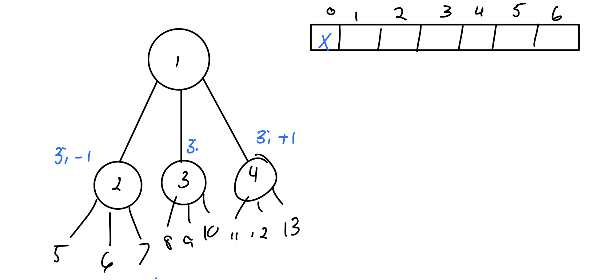
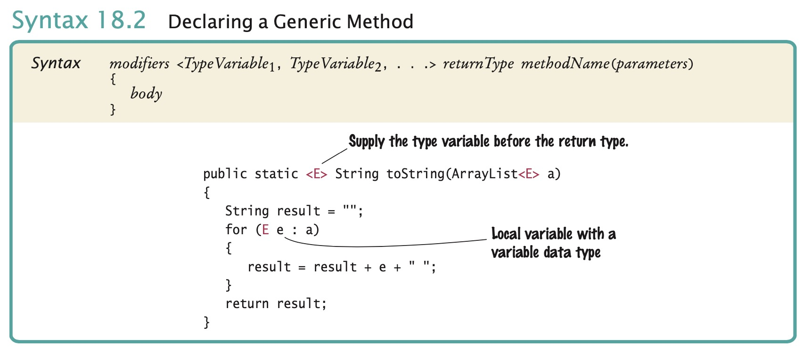
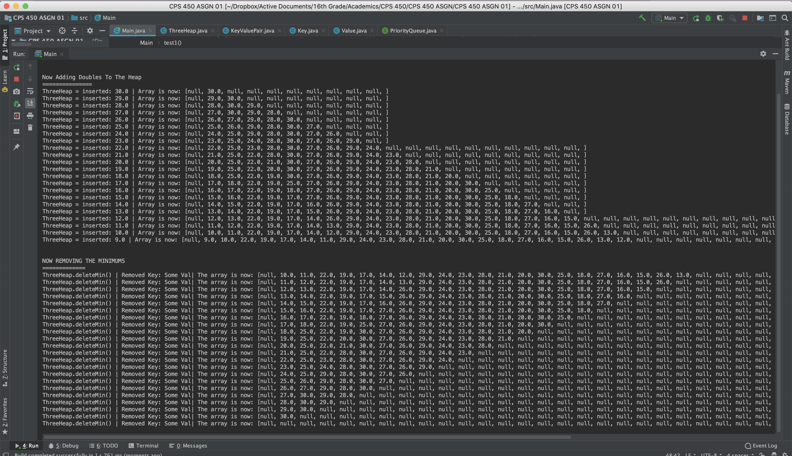

# ASGN 01 Priority Queues Implementation Report

## Challenges

### Starting Early

I completed an assignment very similar to this in Dr. Yao's CPS 350 class. This was an extremely hard one at that time, so I'm glad I got a lot of the hard work done; however, she changed things up a little bit.

This was due on Monday Jun 9, 2020 and I started on the Jun 4. I thought 5 days would be plenty, and it was, but I didn't notice things were different. I tried to use the same code, but that failed because the interface changed and I couldn't re-use a large part of my code.

### The Math

I had all of the math done from last time luckily, but I still had to draw myself out some visualizations and remind myself where items in the heap go in different parts of the array. Luckily, this was just a 3-way heap and not the d-way heap I had to implement last time. This made the math much easier.



### Generic Methods and Classes

Even though I just took CPS 350, a lot of examples had generic classes in them, but I never really knew what they meant or how to use them. I think the only time I was formally introduced to them was when I was 

I spent a lot of time reading and going through old textbooks, but ultimately, I went back to what I knew because I couldn't figure it out. At least now, I know it's something useful that I'll have to learn. 



```java
public class Key<K>{
    //Data Values
    private Double key;

    //CONSTRUCTORS
    public Key(double key) {
        this.key = key;
    }

    /**
     * If the user supplies a string, this method will essentially hash it into something comparable
     * by how long the string is. Longer strings are higher, also sort-of alphabetical. This is probably
     * useless but I made it and have problems letting go of things I made.
     *
     * @param key: A string that someone tried to give as a key instead of a number because they
     *           accidentally thought this was a hashmap ¯\_(ツ)_/¯
     */
    public Key(String key){
        //Function Variables
        double sumOfChars = 0.0;
        String stringify = key;


        //Take the char ASCII code at every value and add it up.
        for (int i = 0; i < stringify.length(); i++){
            sumOfChars += ((int) stringify.charAt(i)); //¯\_(ツ)_/¯
        }
        this.key = sumOfChars;
    }

    public Key(int key){
        this.key = (double)key;
    }


    //MEMBER METHODS
    ...

```

I had tons of trouble casting everything, and so many errors. I'd look them up on Stack Overflow, but oftentimes, especially when I needed to compare to keys of generic type **K**, I couldn't run any of the normal operators. I couldn't say `key > child` or `key.compareTo(anotherKey)`so it felt rather useless to use generic types. It also cluttered my code up because I kept making classes to try and solve problems and once it got to `UnusedClass2` I gave up.

### Comparing to Null

In my design, I have 3 different classes to comply with the interface. First, there's a `Key` type required, so I had to make a Key class. Then, a `Value` class, and I'm probably wrong on this, but I saw the example`{<3.0, “Sophia”>, <3.0, “Sam”>, <6.0, “Emma”>, <7.0, “Tom”},` from the assignment and though I each element contained both of those, so I made a class called `KeyValuePair` to hold the pair before I threw that into the ThreeHeap.

Now, I thought Arrays were initialized to zero, but mine weren't. They were in the last assignment, probably because they were type `double[]` and now they're type `KeyValuePair[]` and that broke all the rules of Java apparently.

Anyways, I had to check if parts of the array were empty, so I tried doing the class `==`, then `object.compareTo().` I even tried converting all the `Key` values into doubles, but nothing worked. This is where I wish I had a smart friend to call up and be like \*help what do I do!\* because I didn't know what to do. After much googling, the best I could come up with is using try/catch blocks as if statements like so:

```java
    protected void restoreDown(int index) throws Exception{
        try{
            while (hasChildren(index) && (array[index].getActualKey() > array[findSmallestChild(index)].getActualKey())){ //While Node > any Child.
                int smallestChild = findSmallestChild(index); //Error. Off by 1 index.
                swap(array, index, smallestChild);
                index = smallestChild;
            }
        }
        catch (NoSuchElementException whatIsThis){
            System.out.println("ThreeHeap.restoreDown.caughtException");
        }
    }
```

### ToString Methods

I keep thinking everything is just part of the Java library function. I really didn't realize that I can't use all the `.compareTo` or `.sort` on my own classes until a lot of googling on stack flow. I knew it was too good to be true when it came to generic classes, so I went down the rabbit hole of _how to cast from K to a String or Integer._ Then my mind was like "FINE I'LL JUST MAKE YOU AN OBJECT STOP GIVING ME ERRORS" and then, luckily, that had a `.toString` method on it. But of course, when I ran that, I got the address reference which was very unhelpful.

I ended up writing my own, like so, but I really didn't like how I did it.

```java
    public String toString(){
//        Start with the empty string.
        String toReturn = "[";

        for (int i = 0; i < array.length; i++){
            try {
                toReturn = toReturn + array[i].getActualKey() + ", ";
            } catch (NullPointerException E) {
                //It's ok, this just means the value is null.
                toReturn = toReturn + "null, ";
            }
        }
        toReturn = toReturn + "]";
        return toReturn;
//        return Arrays.toString(array); //Will print out references instead of values if you change this.
    }
```

I fought with `printf` for a while and had to give up on that, so I went all the way back and started writing toString methods

#### Keys

```java
    public Double getKey() {
//        System.out.println("Key.getKey: " + key);
        return key;
    }

    public void setKey(Double key) {
        this.key = key;
    }

    public Double doubleValue(){
        return key;
    }
}
```


These should really return generic types, like Value instead of Double.


#### Values

```java
public class Value extends Object{
    //Data Member
    private Object theActualObject;
    private String testCase1; //For the method below; it just returns the object as a string, which it is in test1.

    //Constructor
    Value(Object thing){
        theActualObject = thing;
        testCase1 = thing.toString();
    }


    //Methods
    public Object getTheActualObject() {
        return theActualObject;
    }

    //For test 1; it returns the strings.
    //Dr. Yao/Jaimin: I tried to cast type Object to type string, but couldn't and made this as a workaround.
    //TODO: What is a better way I could have done this? (I'd appreciate any feedback/ideas).
    public String getTheActualObjectAsAString(){
        return testCase1;
    }
}

```


I could not convert from object to string, so I had to write a method that does not apply to anything but a string, which I think defeats the purpose of generic classes _\(but also, I don't know much about generic classes, they confuse me\)_.


### Fundamentals Are Holding Me Back

These are things I should've learned in CPS 150/151. I got A's in both classes... and I'll probably get an A in this assignment, but I dislike having to take shortcuts like this. I know everyone does it - but I want to get better, not do whatever I can to get things to compile.

## Running Times

Below are all the running times for the **worst case**.

**isEmpty**

```text
public boolean isEmpty(){
    return heapSize == 0;
}
```

The isEmpty function is O\(1\) since I have a variable that holds everything constant.

**size**

All functions on size are constant `O(1)`. It gets increased when you add something to the heap and decreased when something is removed.

**findMin**

Find min is `O(1)` because the smallest variable is always on the top of the heap. In the code below, I set `toReturn` to `array[1]`. The smallest will always be at `array[1]`, so this always works.

```text
@Override
public double deleteMin() throws NoSuchElementException {

    //Check to make sure there is something in the heap.
    if(heapSize == 0){
        throw new NoSuchElementException("Heap Is Empty.");
    }

    double toReturn = array[1]; //Temp variable to hold a[min]
```

**deleteMin**

My deleteMin is `O(d*log(N) (log base d, not 2)` was the hardest part to implement and I had so many bugs. As a result, I broke down the function into many sub functions which you can see in my code.

## Test Code

Here is the main test code I ran. It simply adds a bunch of numbers as keys and strings as values. The values are the same, I just had to add something.


All of the input values are strings, and all of the keys are converted to doubles.


```java
    /**
     * Test 1: Add 22 things to the heap & attempt to remove 6 of them.
     * @throws InterruptedException: Small pauses to show each operation.
     * @throws java.util.NoSuchElementException: Intentional attempt to remove 6. Not handled.
     */
    protected static void test1() throws Exception{
        //Make the things & add them to the object.
        System.out.println("\nTest 1: Add 22 doubles and remove 22. Will throw a NoSuchElement Exception" +
                "for trying to dequeue more heaps than that which exist...\n");
        Thread.sleep(500);
        ThreeHeap myHeap = new ThreeHeap();

        System.out.println("\nNow Adding Doubles To The Heap\n===============");
        for (int i = 0; i < 22; i++){
            //Make the object I'm going to insert.
            Key toInsert = new Key(-i+30);
            Value val = new Value("Some Val");


            //Insert the pair into the heap.
            myHeap.insert(toInsert, val);
            Thread.sleep(100); //For debugging
            System.out.println("ThreeHeap = " + "inserted: "+toInsert.getKey() + " | Array is now: " + myHeap.toString()); //For debugging
            Thread.sleep(100); //For debugging
        }

        System.out.println("\n\nNOW REMOVING THE MINIMUMS \n=============");
        for (int i = 0; i < 22; i++){ //TODO: Change to 23+ if you want the EmptyPQException to be thrown.
            String temp2 = (myHeap.deleteMin()).getTheActualObjectAsAString();
            Thread.sleep(500); //For debugging
            System.out.println("ThreeHeap.deleteMin() | Removed Key: " + temp2 + "| The array is now: " + myHeap.toString());
        }
    }
```



The primary test shown here adds a bunch of elements to an array and is easily modifiable for other tests.

## Final Note


I modified the interface to throw exceptions. I think the names "key" and "val" were changed too by my IDE while refactoring.


```java
    public void insert(Key key, Value val) throws Exception; //I changed this to handle an exception.

    /**
     * Removes the pair with the minimum key from the priority queue 
     * and returns its value
     * @return the value of the pair that has the minimum key
     * @throws EmptyPQException
     *             if priority queue contains no elements
     */
    public Value deleteMin() throws Exception;

    /**
     * Resets the priority queue to appear as not containing any elements.
     */
```


