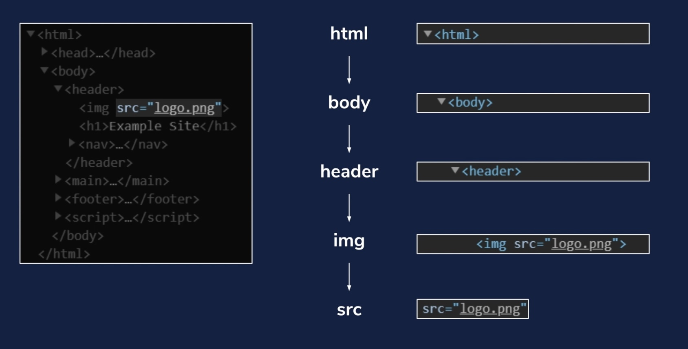

# Javascript Interactive Websites

## Goals

* Add javascript to make websites more interactive and dynamically change content.
* Understand what the DOM is and what DOM events are.
* Create forums using HTML and validate them with JavaScript.

## Cheatsheet



Good article because my notes don't make sense:




## Using the &lt;script&gt; tag

* You can have HTML reference/call the JS code.

```markup
<body>
	<section class = "container">
  	
  	<p onclick="blooming()">Codecademy</p> // Will call blooming() below. 
	</section>

  <!-- Paste your code in the script element below:  -->
  <script>
    function blooming(){
      var image = document.getElementById('myImage');
      if (image.src.match("normal")) {
        image.src = "flower.png";
      } else{
        img.src = "normal.png";
      }
    }
  </script>
```

## Referencing JS in other files

If you want to link code instead of embed it, you can link it using the **src attribute.** Use it like this:

```text
<script src="./exampleScript.js"></script>
```

* This script will look for a file called "exampleScript.js" in the same folder as the index.html file.
* It can also reference [CDNs](https://developer.mozilla.org/en-US/docs/Glossary/CDN).

### Where to Place the Script Tags

* Browsers come equipped with HTML parsers to help render the elements accordingly.
* Elements using the &lt;script&gt; tag are parased in the order they appear in HTML.
* When the HTML parser encounters a `<script>` element, it will load and execute the contents before parsing the res of the HTML.
  * It will not process the next element in the HTML until it loads/executes the &lt;script&gt; element which could cause a delay and poor user experience.
  * Scripts are loaded sequentially, so if one script depends on another, they should be placed in the correct order in the HTML file.


## The Defer Attribute

* HTML 4 introduced the defer and `async` attributes of the `<script>` elements to improve user wait-times.
* When the HTML parser encounters a script with the `defer` attribute, it'll load the script but defers the execution until it finishes parsing the rest of the HTML file.

### Syntax

Use it when it interacts with the DOM.

```text
<script src="example.js" defer></script> 
```

## The Async Attribute

* The async attribute loads and executes the script asynchronously with the rest of the page. 
* It's useful for scripts that do not depend on each other. 
* Optimizes web page load time well.

### Syntax

```text
<script src="example.js" async></script>
```

## Putting it All Together: First Project




## JS and the DOM



* The DOM is a way to model the objects in a document.
* The DOM is a tree data structure. It's the underlying objects that make up the document.
  * It's not just HTML. It could be represented like HTML, but could be generated by react or PHP or JS.
  * There are other types of documents like XML and SVG that are modeled as DOM structures.
  * The DOM is a link between an HTML web page and scripting languages.



## Accessing and Modifying Content

### Inner HTML

We can access and modify HTML elements like so:


### CSS, Class, and ID


