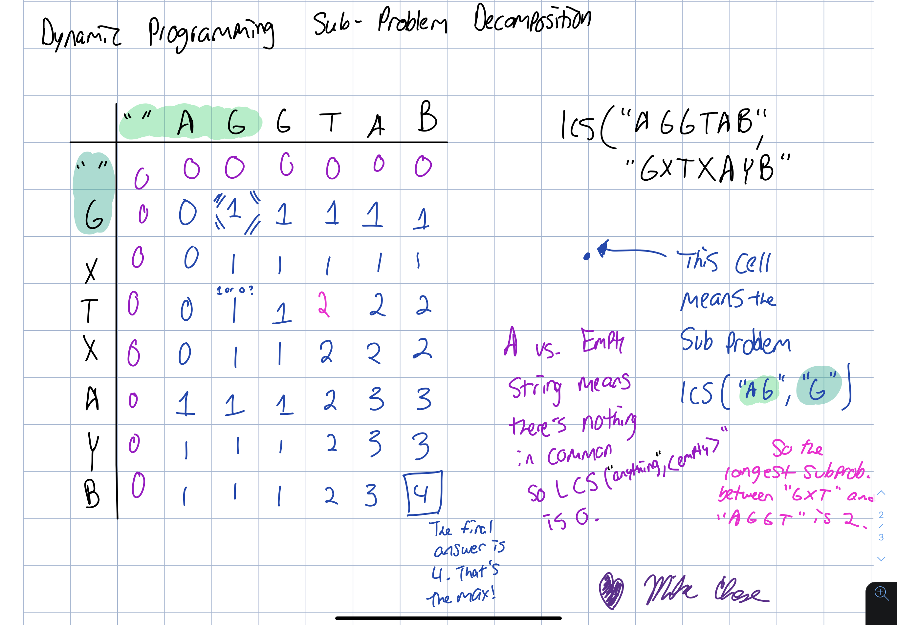

# Lecture 07: Longest Common Subsequence

## Recall: Four Step Method

> 1. **Characterize the structure of an optimal solution**. _\(What are the sub-problems?\)_
> 2. **Recursively define the value of an optimal solution.** _\(i.e. recurrence for Fibonacci\(n\): Fib\(n\) = Fib\(n-1\)+\(n-2\), which is a formula involving only smaller sub-problems._
> 3. **Compute the value of an optimal solution in a** _**bottom-up**_ **fashion**. Store \(memorize\) the results of all sub-problems, which can then be later accessed to solve other sub-problems.
> 4. **Construct an optimal solution from computed information.**
>
> _Source: Dr. Yao's Slides, Dynamic Programming Part 1. \(Paraphrased\)_

## The Longest Common Subsequence Problem

### The Problem

Given 2 sequences \(shown below\), find a subsequence common to both whose length is _longest_.

$$
X=\{x_1, x_2, ... x_n\} \text{ and } Y=\{y_1, y_2, ... y_n\}
$$


A subsequence doesn't have to be consecutive, but it has to be in order.




So the run time is pretty bad. I didn't write out how to do it, but Dr. Yao says it's:

$$
T=O(2^n)
$$

Because there are n letters, there are `2^n` subsequences, worst case. 



### Sub Problems

When we want to break a problem into smaller sub-problems, oftentimes, we **start at the end** and work backwards. Let's look at an example. Say we have two substrings: `size = lcs("aab", "azb")`.

When we work backwards, we'll start at the ending character, and we see `b` is common in both terms. So what do we do? We say `size = 1+lcs("aa", "az")` and continue down recursively. When we call `lcs("aa", "az")`, we have two options:

1. `lcs("a", "az")`
2. `lcs("aa", "a")`

Here's what we did. We looked at the very ending of the two characters, `a` and `z` and noticed that they're not the same. So, we now try removing one of the characters and solving the problem, and then, we'll try the opposite problem and compare their longest substrings. We'll want to find the maximum, largest common given these options. Whichever of these calls gives us a longer substring, we're going to take that as the largest and add it to `1` in the stack frame. We're cutting off character by character by character, and we want to see _what's the longest subsequence when we cut off different characters?_ **The final recursive call looks like: `size = 1 + max(lcs("a", "az"), lcs("aa", "a"))`**

#### The Left Half

So, recursively of course, we now look at smaller problems and there are again two cases:

`max(lcs("<empty>", "az"), lcs("a", "a"))`. After cutting off one character from both cases and comparing the maximum, we find that going with `a` is the largest substring. So now, we replace it with `1+max(lcs("<empty>", "<empty>"), lcs("<empty>", "<empty>"))`. Those are all base cases, so all the empty cases return `0`. The right half follows in a similar problem.

#### The Base Case

* If any of the substrings are empty, we can't have anything in common, so it's zero. 

### Dynamic Programming Sub-Problem Decomposition

## Complexity

* n=s1.len
* m=s2.len
* **Time: `O(mn)`**
* **Space: `O(mn)`**

Obviously, this is way better than brute force.



